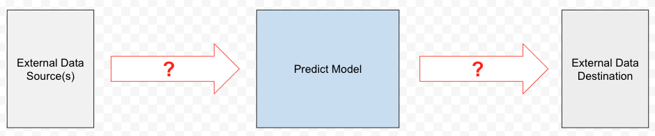

Distributed System/Processing
-----------------------------

### Pipeline orchestration flow

Given a prediction pipeline that scheduled hourly (user:

1.  Describe the main components and flow and you see it.

2.  Provide a general description of its scheduling and orchestration, including:

    1.  User configured scheduling per pipelined

    2.  Prevent from multiple pipelines to run at the same time

3.  Non-functional requirements include 
    
    1.  Error handling / Alerting

2.  Redundancy (e.g. Task resumption in case of interruption)

3.  High data volume (e.g. 50M contacts + 500M events)

A prediction pipeline starts with collecting the required data (based on predefined configuration/filters), runs a pre-trained model and ends in writing the prediction output back to the system.

E.g. lead scoring - collect all data, from all sources, related to leads, predict a score per lead, and write the score back to the source system, per lead. 

You can assume the existence of:

*   Data sources APIs

*   Predict service (model)

    *   Input - getting a (CSV) file with the following schema

        *   Record key/id

        *   Predefined set of features

    *   Output:

        *   A (CSV) file with the predictions results

            1.  Record id/key

            2.  Propensity score

            3.  (SHAP values)

#### Bonus Distributed rate limit (Data Collection) - bonus/if the topic is raised

*   Data collection - we have a resource which has a rate limit. We would like to access this resource through multiple different clients and respect the rate limit. Suggest a way to achieve it. Identify pros/cons (limitations ,etc)